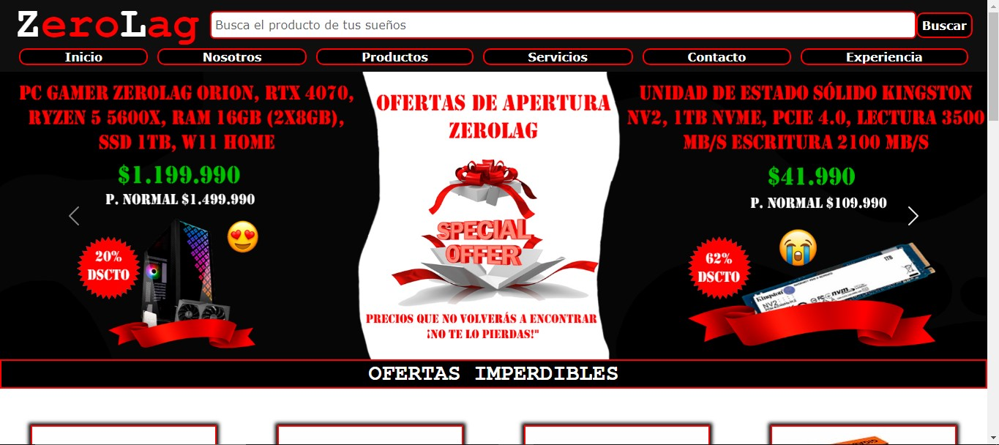
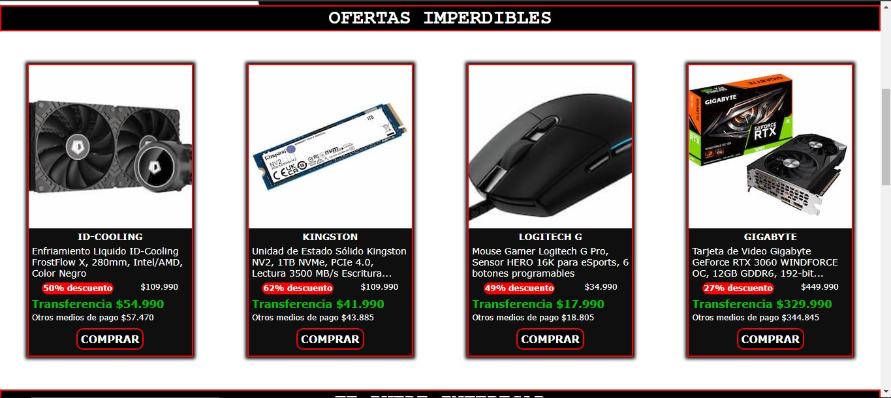
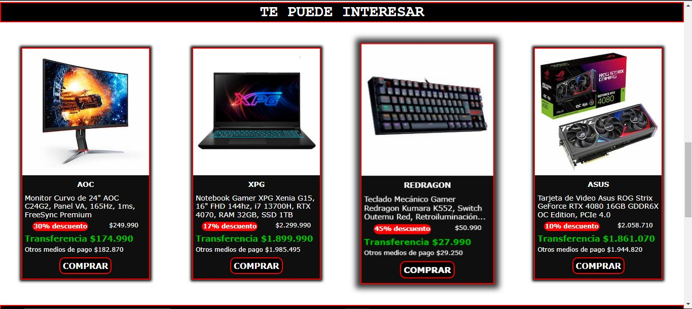
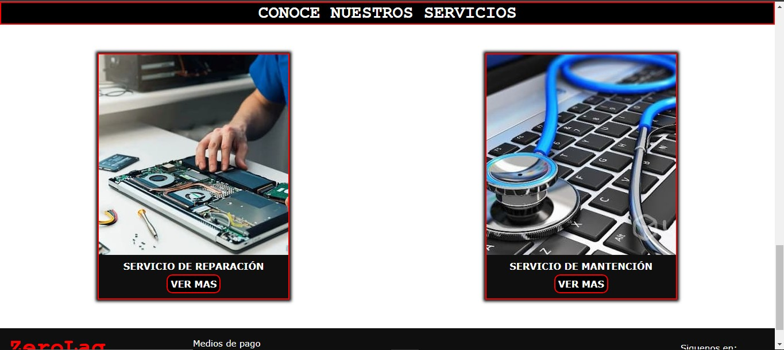
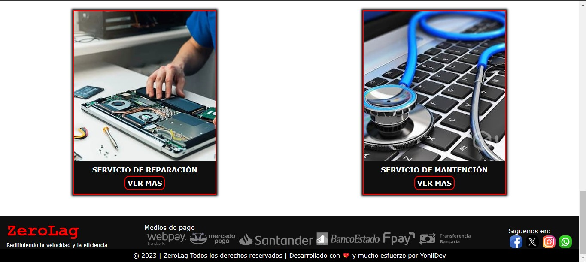

# ZeroLag

## Descripción
ZeroLag es un sitio web estático de tipo e-commerce, creado durante el curso de Desarrollo Web en CoderHouse. Este sitio simula una tienda de productos y servicios tecnológicos. Fue elaborado desde cero utilizando tecnologías como HTML, CSS y Bootstrap.

## Tabla de Contenidos
- [ZeroLag](#zerolag)
  - [Descripción](#descripción)
  - [Tabla de Contenidos](#tabla-de-contenidos)
  - [Características](#características)
  - [Tecnologías Utilizadas](#tecnologías-utilizadas)
  - [Screenshot.](#screenshot)
    - [Inicio](#inicio)

## Características

- **Catálogo de productos:** Los usuarios pueden visualizar un catálogo de productos disponibles para la venta, con detalles y precios.

- **Navegación entre páginas:** El sitio web cuenta con cinco páginas diferentes: Inicio, Nosotros, Productos, Servicios, Contacto y Experiencia. Los usuarios pueden acceder fácilmente a cada una de estas páginas desde el menú de navegación ubicado en el encabezado.

- **Redes Sociales:** Incluye enlaces que simulan redirigir a los usuarios a las redes sociales de la tienda.

- **Carrusel:** Presenta un carrusel dinámico que destaca las mejores ofertas de la tienda.

- **Etiquetas Semánticas:** Se han utilizado etiquetas semánticas en la estructura del sitio web para mejorar la accesibilidad y el posicionamiento en los motores de búsqueda.

- **Estilos anidados:** Se ha utilizado SASS (Syntactically Awesome Stylesheets), un preprocesador de CSS, para organizar y anidar los estilos de manera jerárquica (padre-hijo), lo que genera un CSS más limpio y organizado.

- **Animación y transición:** Al posicionar el ratón sobre una tarjeta de producto, esta se agrandará ligeramente en comparación con las demás, simulando un acercamiento a la pantalla.

- **Imagenes dimensionadas:** Cada imagen está dimensionada según el tamaño requerido en la página, lo que ayuda a la optimización del sitio web y al posicionamiento en los motores de búsqueda.

## Tecnologías Utilizadas

- HTML
- CSS
- SASS
- BOOTSTRAP
- GIT
- GITHUB

## Screenshot.

A continuación se muestran las imágenes de las distintas páginas que tiene el sitio web.

### Inicio

    

    

    

    

    
    

