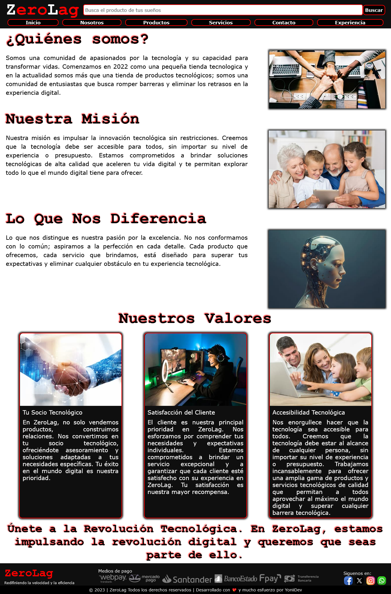

# ZeroLag

## Descripción
ZeroLag es un sitio web estático de tipo e-commerce, creado durante el curso de Desarrollo Web en CoderHouse. Este sitio simula una tienda de productos y servicios tecnológicos. Fue elaborado desde cero utilizando tecnologías como HTML, CSS y Bootstrap.

## Tabla de Contenidos
- [ZeroLag](#zerolag)
  - [Descripción](#descripción)
  - [Tabla de Contenidos](#tabla-de-contenidos)
  - [Características](#características)
  - [Tecnologías Utilizadas](#tecnologías-utilizadas)
  - [Capturas de pantalla de la Versión de Escritorio](#capturas-de-pantalla-de-la-versión-de-escritorio)
    - [Página de Inicio Versión de Escritorio](#página-de-inicio-versión-de-escritorio)
    - [Página de Nosotros Versión de Escritorio](#página-de-nosotros-versión-de-escritorio)
    - [Página de Productos Versión de Escritorio](#página-de-productos-versión-de-escritorio)
    - [Página de Servicios Versión de Escritorio](#página-de-servicios-versión-de-escritorio)
    - [Página de Contacto Versión de Escritorio](#página-de-contacto-versión-de-escritorio)
    - [Página de Experiencia Versión de Escritorio](#página-de-experiencia-versión-de-escritorio)
  - [Capturas de pantalla de la Versión Móvil](#capturas-de-pantalla-de-la-versión-móvil)
    - [Página de Inicio Versión Móvil](#página-de-inicio-versión-móvil)
    - [Página de Nosotros Versión Móvil](#página-de-nosotros-versión-móvil)
    - [Página de Productos Versión Móvil](#página-de-productos-versión-móvil)
    - [Página de Servicios Versión Móvil](#página-de-servicios-versión-móvil)
    - [Página de Contacto Versión Móvil](#página-de-contacto-versión-móvil)
    - [Página de Experiencia Versión Móvil](#página-de-experiencia-versión-móvil)
  - [Instalación](#instalación)
    - [Requisitos previos](#requisitos-previos)
    - [Instrucciones de instalación](#instrucciones-de-instalación)
  - [Uso](#uso)
    - [Guía rápida](#guía-rápida)
  - [Autores](#autores)
  - [Agradecimientos](#agradecimientos)
<br>

## Características

- **Catálogo de productos:** Los usuarios pueden visualizar un catálogo de productos disponibles para la venta, con detalles y precios.

- **Navegación entre páginas:** El sitio web cuenta con cinco páginas diferentes: Inicio, Nosotros, Productos, Servicios, Contacto y Experiencia. Los usuarios pueden acceder fácilmente a cada una de estas páginas desde el menú de navegación ubicado en el encabezado.

- **Redes Sociales:** Incluye enlaces que simulan redirigir a los usuarios a las redes sociales de la tienda.

- **Carrusel:** Presenta un carrusel dinámico que destaca las mejores ofertas de la tienda.

- **Etiquetas Semánticas:** Se han utilizado etiquetas semánticas en la estructura del sitio web para mejorar la accesibilidad y el posicionamiento en los motores de búsqueda.

- **Estilos anidados:** Se ha utilizado SASS (Syntactically Awesome Stylesheets), un preprocesador de CSS, para organizar y anidar los estilos de manera jerárquica (padre-hijo), lo que genera un CSS más limpio y organizado.

- **Animación y transición:** Al posicionar el ratón sobre una tarjeta de producto, esta se agrandará ligeramente en comparación con las demás, simulando un acercamiento a la pantalla.

- **Imagenes dimensionadas:** Cada imagen está dimensionada según el tamaño requerido en la página, lo que ayuda a la optimización del sitio web y al posicionamiento en los motores de búsqueda.

- **Etiquetas Meta:** Se han utilizado las etiquetas meta description y meta keyword en cada una de las páginas del sitio web para mejorar el posicionamiento en los motores de búsqueda. 
  
- **Formulario de Contacto:** Se elaboró la estructura de un formulario de contacto utilizando HTML y CSS.

- **Responsive:** El sitio web ZeroLag es totalmente responsivo hasta un ancho mínimo de 320px, pudiéndose visualizar en varios tamaños de pantalla: celular, tablet o desktop.
<br>

## Tecnologías Utilizadas

- HTML
- CSS
- SASS
- BOOTSTRAP
- GIT
- GITHUB
<br>
<br>

## Capturas de Pantalla de la Versión de Escritorio
<details>
<summary>Click para expandir las capturas de pantalla</summary>
<br>
A continuación se muestran las imagenes de la versión de escritorio del sitio web.

### Página de Inicio Versión de Escritorio


<br>
<br>

### Página de Nosotros Versión de Escritorio


<br>
<br>

### Página de Productos Versión de Escritorio


<br>
<br>

### Página de Servicios Versión de Escritorio


<br>
<br>

### Página de Contacto Versión de Escritorio


<br>
<br>

### Página de Experiencia Versión de Escritorio


</details>

## Capturas de Pantalla de la Versión Móvil
<details>
  <summary>Click para expandir las capturas de pantalla</summary>
  <br>
A continuación se muestran las imagenes de la versión móvil del sitio web.

<div style="display: flex; justify-content: space-around;">
  <div style="text-align: center;">
    <h3>Página de Inicio Versión Móvil</h3>
    
  </div>
  <div style="text-align: center;">
    <h3>Página de Nosotros Versión Móvil</h3>
    
  </div>
</div>

<div style="display: flex; justify-content: space-around;">
  <div style="text-align: center;">
    <h3>Página de Productos Versión Móvil</h3>
    
  </div>
  <div style="text-align: center;">
    <h3>Página de Servicios Versión Móvil</h3>
    
  </div>
</div>

<div style="display: flex; justify-content: space-around;">
  <div style="text-align: center;">
    <h3>Página de Contacto Versión Móvil</h3>
    
  </div>
  <div style="text-align: center;">
    <h3>Página de Experiencia Versión Móvil</h3>
    
  </div>
</div>
</details>
<br>

## Instalación

### Requisitos previos

Antes de instalar y ejecutar el proyecto ZeroLag, asegúrate de tener lo siguiente:

- Un navegador web actualizado (Google Chrome, Mozilla Firefox, Microsoft Edge, etc.).
- [Visual Studio Code](https://code.visualstudio.com/) recomendado para ejecutar este proyecto.
- [Git](https://git-scm.com/) instalado en tu sistema para clonar el repositorio.
- [Node.js](https://nodejs.org/) y [npm](https://www.npmjs.com/) (Node Package Manager) instalados, si planeas utilizar herramientas de desarrollo adicionales como preprocesadores CSS (opcional).
- [LiveServer](https://marketplace.visualstudio.com/items?itemName=ritwickdey.LiveServer) extensión de Visual Studio Code sugerida para iniciar un servidor local de desarrollo con función de recarga en vivo.

### Instrucciones de instalación

Sigue estos pasos para instalar y ejecutar el proyecto ZeroLag en tu máquina local:

1. **Definir directorio**

    Se recomienda tener definido el directorio donde se clonará el proyecto y abrir el Visual Studio Code haciendo referencia a la ruta de esa carpeta.
<br>

2. **Clonar el repositorio**
  
   Una vez definido el directorio donde se clonará el proyecto, en la terminal de Visual Studio Code, ejecuta el siguiente comando para clonar el repositorio a tu máquina local:

        ```sh
        git clone https://github.com/YoniiDev/ZeroLag.git

    Si estás utilizando un entorno de desarrollo con soporte para Live Server, puedes clonar el proyecto en ese entorno para una mejor experiencia de desarrollo.
<br>

3. **Navegar al directorio del proyecto**

    Cambia el directorio actual a la carpeta del proyecto clonado, para eso copie el siguiente código:

      ```sh
      cd ZeroLag
<br>

4. **Abrir el proyecto**

    Ahora puedes abrir el archivo index.html en tu navegador web favorito para ver el sitio web. 

    En el Visual Studio Code, instala la extensión [Live Server](https://marketplace.visualstudio.com/items?itemName=ritwickdey.LiveServer). Una vez finalizada la instalación de la extensión, haz clic derecho en el archivo index.html y selecciona "Open with Live Server".
    <br>
    <br>
    <div style="text-align: center;">
    
    </div>
    <br>
    <br>
    O bien, ejecuta la extensión Live Server desde la barra de estado de Visual Studio Code.
    <br>
    <br>
    <div style="text-align: center;">
    
    </div>
    <br>
    <br>
    El proyecto se abrirá en el navegador web de forma predeterminada en el archivo index.html.
    <br>
    <br>

5. **Instalar dependencias (opcional)**

    Si deseas modificar y desarrollar el proyecto utilizando SASS y otras herramientas, asegúrate de tener Node.js y npm instalados, luego ejecuta el siguiente comando para instalar las dependencias:

       ```sh
        npm install

    Después de instalar las dependencias, puedes ejecutar el preprocesador SASS para compilar los estilos:

        ```sh
        npm run watch-css

    Esto compilará los archivos SASS a CSS y aplicará los cambios en tiempo real. Cabe destacar que solo se deben modificar los estilos en los archivos con la extensión .scss y no modificar, por ningún motivo, el archivo estilos.css.
<br>

6. **Personalizar el proyecto**

    Ahora puedes realizar modificaciones en el proyecto según tus necesidades. Todos los archivos HTML, CSS, y SASS están organizados en sus respectivos directorios.

¡Listo! Ahora deberías tener el proyecto ZeroLag instalado y listo para usar en tu máquina local. Si tienes algún problema durante el proceso de instalación, no dudes en revisar la documentación oficial de las herramientas mencionadas.
<br>
<br>

## Uso

### Guía rápida

Una vez que hayas instalado el proyecto ZeroLag siguiendo las instrucciones de la sección anterior, puedes utilizar el sitio web e-commerce de la siguiente manera:

1. **Abrir el sitio web**

    Inicia el servidor de desarrollo Live Server en Visual Studio Code y el sitio web se abrirá automáticamente en tu navegador predeterminado.
    <br>
    <br>
    La siguiente imagen muestra cómo iniciar la extensión Live Server desde la barra de estado de Visual Studio Code.
    <br>
    <br>
    <div style="text-align: center;">
    
    </div>
    <br>
   Tambien puedes abrir el archivo `index.html` en tu navegador web, haciendo click derecho sobre `index.html` y luego en Open with Live Server.
    <br>
    <div style="text-align: center;">
    
    </div>
<br>

2. **Navegación del sitio**

   Utiliza el menú de navegación en la parte superior de la página para explorar las diferentes secciones del sitio web:

   - **Inicio:** Página principal del sitio con una vista general de la tienda.
   - **Nosotros:** Información sobre la tienda y su equipo.
   - **Productos:** Catálogo de productos disponibles para la venta.
   - **Servicios:** Información sobre los servicios ofrecidos por la tienda.
   - **Contacto:** Formulario de contacto para que los usuarios se pongan en contacto con la tienda.
   - **Experiencia:** Página con testimonios y experiencias de clientes.
<br>

3. **Interacción con el contenido**

Dado que este proyecto es un sitio web estático y no incluye funcionalidades dinámicas como una aplicación web completa, la interacción que hay con el contenido es casi nula.

 - **Carrusel:** En la página de inicio, utiliza las flechas del carrusel para navegar a través de las ofertas destacadas.
 - **Formulario de contacto:** Completa el formulario de contacto y envía tus consultas o comentarios. Nota: Esta es una simulación y el formulario no enviará datos reales a un servidor.
<br>

## Autores

El proyecto ZeroLag ha sido desarrollado por:

- **YoniiDev** - Desarrollador principal
  - [GitHub](https://github.com/YoniiDev)
<br>

## Agradecimientos

Agradecimientos especiales al profesor y a los tutores que hicieron posible que este curso fuera una buena experiencia. Gracias por el esfuerzo en transmitirnos los conocimientos necesarios para realizar este proyecto y enseñarnos a utilizar estas herramientas tecnológicas que, sin duda alguna, me servirán para desarrollar proyectos en el futuro.